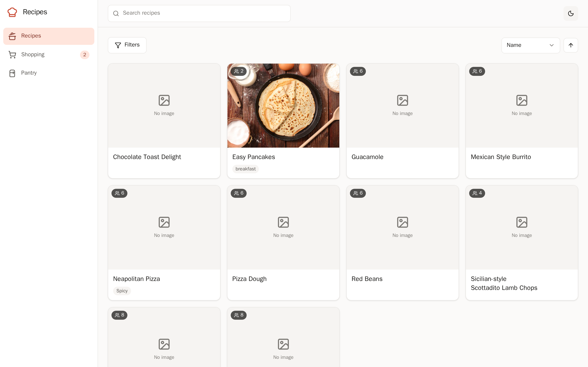
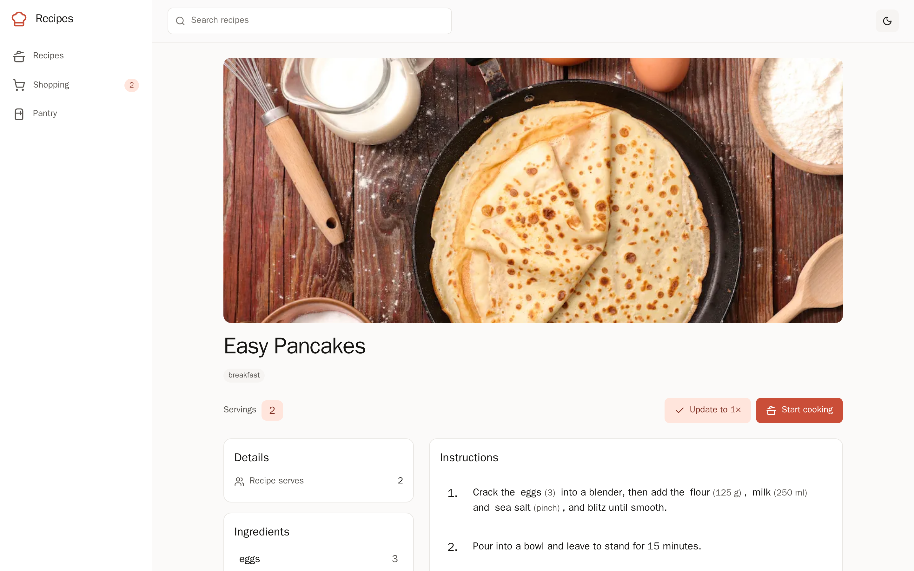
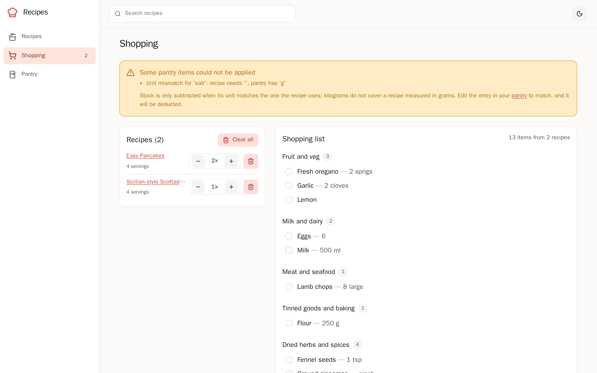
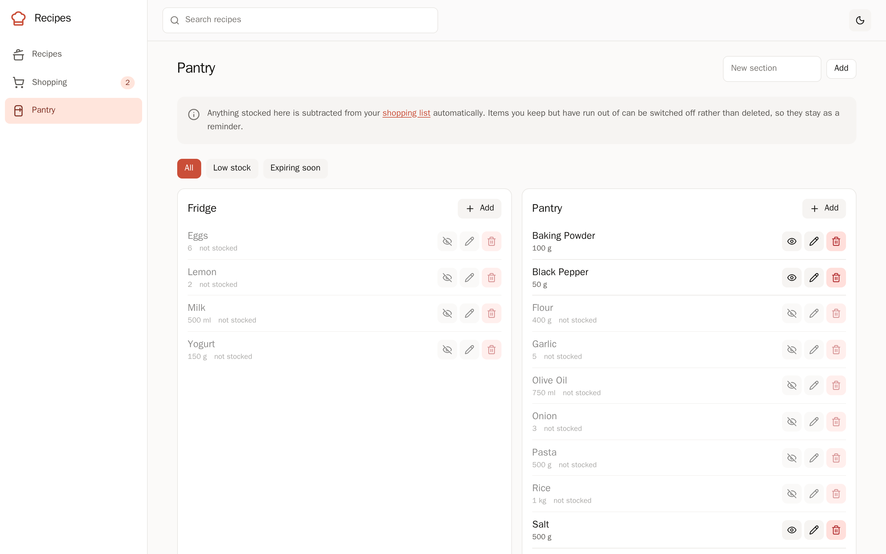
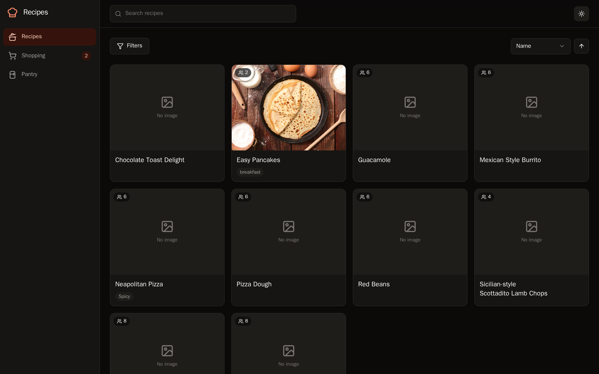

# cooklang-web

A self-hosted web app for a [Cooklang](https://cooklang.org/) recipe library.
Point it at a directory of `.cook` files — typically a NAS share — and it gives
you a browsable, searchable collection, a combined shopping list, and a pantry
whose contents are deducted from that list.



|                                       |                                                |
| ------------------------------------- | ---------------------------------------------- |
|    |  |
|  |        |

### Features

- **Recipes** — browse, search and filter a directory of `.cook` files,
  including subdirectories, with a cook mode that walks you through the steps
  and runs timers.
- **Shopping lists** — combine recipes at any scale, with quantities merged
  across them and grouped by supermarket aisle.
- **Aisles** — edit `aisle.conf` from the app: arrange the aisles into the
  order you walk the shop, see which ingredients in your library have no aisle
  yet, and give one an aisle straight from the shopping list.
- **Pantry** — track what you have in stock; anything listed is subtracted
  from the shopping list automatically.

## Tech Stack

- **Framework**: [SvelteKit](https://kit.svelte.dev/) - Full-stack web framework
- **UI**: [Tailwind CSS](https://tailwindcss.com/) v4 with a custom token layer, and
  [Bits UI](https://bits-ui.com/) for accessible primitives
- **Icons**: [Lucide Svelte](https://lucide.dev/)
- **Recipe parsing**: [@cooklang/cooklang](https://github.com/cooklang/cooklang-rs) (WASM) for display, plus the [cook CLI](https://github.com/cooklang/cookcli) for shopping lists
- **Images**: [imgproxy](https://imgproxy.net/) behind a caching [Caddy](https://caddyserver.com/)
- **Deployment**: Node.js adapter, shipped as a container

## Development

### Prerequisites

- Node.js 24
- npm
- Optionally the [cook CLI](https://github.com/cooklang/cookcli), which is only
  needed for shopping lists

### Setup

Install dependencies:

```sh
npm install
```

### Running the Development Server

Start the development server with hot module replacement:

```sh
npm run dev
```

Point it at your own recipes with `RECIPE_PATH`; it defaults to the sample
`recipes/` directory in this repo.

### Checks

Typecheck, lint and test in one go — this is what CI runs:

```sh
npm run verify
```

Individually: `npm run check`, `npm run lint`, `npm test`. `npm run format`
applies Prettier.

Tests cover the logic that is easy to get quietly wrong: the pantry and aisle
file parsers (each of which round-trips its real config byte for byte,
comments included, and the aisle one reorders a category without disturbing a
line around it), URL slugs, imgproxy URL signing, quantity formatting, aisle
ordering, aisle coverage and pantry unit comparisons. Behaviour that depends
on the `cook` binary is checked by `scripts/smoke-cook.mjs` against the real
thing rather than mocked.

## Building

Create a production build:

```sh
npm run build
```

Preview the production build locally:

```sh
npm run preview
```

## Deployment

The recipe library is expected to live on network storage, which is slow to
read from. Two things keep that off the request path:

- **A recipe index.** Recipes are read and parsed once and kept in memory,
  refreshed only when a file's mtime or size changes.
- **An image pipeline.** `imgproxy` resizes images to the sizes actually
  rendered, and a caching Caddy in front of it means a given derivative is
  produced once. A typical recipe photo drops from ~950 KB to ~40 KB.

```
browser → caddy (cache) → imgproxy → recipe directory (read-only)
                        → app      → recipe directory (read-write)
```

Copy `.env.example` to `.env`, set `RECIPES_HOST_PATH` to the recipe
directory, generate a signing key pair, and start the stack:

```sh
openssl rand -hex 32
```

```sh
docker compose up -d
```

Only Caddy publishes a port. `imgproxy` is reachable solely from inside the
compose network, so it cannot be used as an open image resizer.

### Configuration

| Variable              | Default     | Purpose                                                        |
| --------------------- | ----------- | -------------------------------------------------------------- |
| `RECIPE_PATH`         | `./recipes` | Directory holding `.cook` files                                |
| `COOK_CLI_PATH`       | `cook`      | Cook CLI binary, used for shopping lists                       |
| `COOK_CLI_TIMEOUT`    | `30000`     | Cook CLI timeout in ms                                         |
| `RECIPE_INDEX_TTL_MS` | `30000`     | How long the index serves before re-stat'ing (`0` in dev)      |
| `IMGPROXY_BASE_URL`   | _unset_     | Where imgproxy is mounted. Unset serves originals from the app |
| `IMGPROXY_KEY`        | _unset_     | Hex URL-signing key                                            |
| `IMGPROXY_SALT`       | _unset_     | Hex URL-signing salt                                           |
| `PROTOCOL_HEADER`     | _unset_     | Proxy header carrying the scheme; set by compose               |
| `HOST_HEADER`         | _unset_     | Proxy header carrying the host; set by compose                 |
| `ORIGIN`              | _unset_     | Public URL, if your proxy sends neither of the above           |

Both `IMGPROXY_KEY` and `IMGPROXY_SALT` must be set alongside
`IMGPROXY_BASE_URL`; if they are not, the app logs a warning and falls back to
serving original images itself.

The `cook` CLI is only needed for shopping lists. Without it the rest of the
app works, and `/shopping` explains what is missing rather than failing.

`PROTOCOL_HEADER` and `HOST_HEADER` are set for you in `docker-compose.yml`.
They are not optional behind a proxy: SvelteKit rejects a form POST whose
`Origin` does not match the origin it believes it is serving, so without them
every submission fails with "Cross-site POST form submissions are forbidden".

### Health

`/health` reports whether the recipe directory is readable, how many recipes
were found, and whether the `cook` CLI is available. It returns 503 when the
recipe directory cannot be read, so a forgotten volume mount surfaces as an
unhealthy container rather than an empty-looking library. The container
healthcheck uses it, and Caddy waits for it before starting.

### After upgrading the cook CLI

The shopping list and pantry depend on CLI behaviour that unit tests cannot
cover, because they mock the binary away. `scripts/smoke-cook.mjs` asserts it
against the real binary and real recipes:

```bash
docker compose run --rm app node scripts/smoke-cook.mjs
```

It checks that recipes in subdirectories resolve, that `:n` scales them, that
`--base-path` works, that recipe references expand, and — the two the pantry
and aisles pages rest on — that `config/aisle.conf` and `config/pantry.conf`
are discovered automatically, with stocked ingredients subtracted and unit
mismatches warned about rather than silently ignored.

It also pins down the `aisle.conf` grammar the aisles page writes: that `|`
separates alternative names and the first one is canonical, that `//` starts a
comment, that ingredients are matched against the file by the name the recipe
writes, and that anything unmatched lands in `other` — which is the group the
shopping list offers an aisle picker for.
